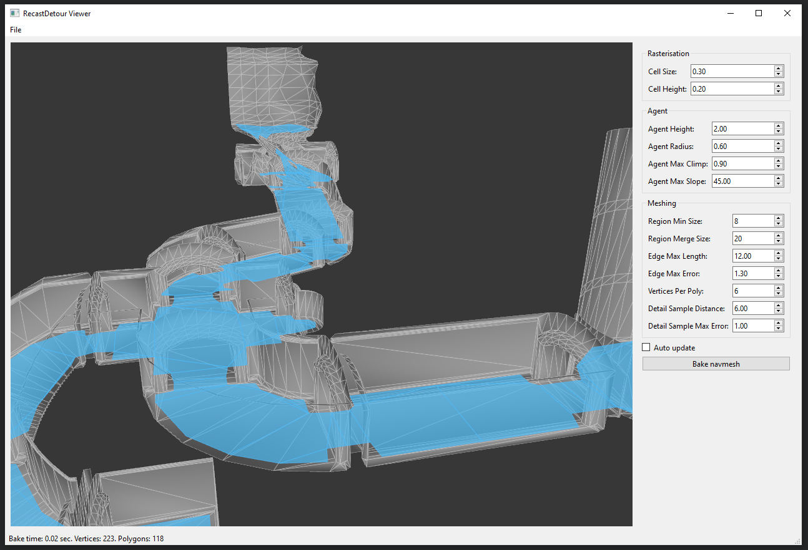

## What is it

This is Python binary library for generating and using navigation mesh. Based on [RecastNavigation](https://github.com/recastnavigation/recastnavigation) c++ library.

Feature:
* Generate navmesh from *.obj file and also from raw vertices and polygons data
* Save and load navmesh to (and from) binary file
* Generate triangulation and poligonization of the navmesh for using in external applications
* Find the shortest path between two input points and the shortest distance to the navmesh wall from the input point
* Works in 64-bit Python 3.6 - 3.10 and Python 2.7 on Windows only

## How to use

Import module

```python
import recastdetour as rd
```

Create navmesh object

```python
navmesh = rd.Navmesh()
```

Init geometry

```python
navmesh.init_by_obj("location.obj")
```

Generate navmesh data

```python
navmesh.build_navmesh()
```

Find the shortest path between two points

```python
start = [2.0, 0.0, 3.0]
end = [-1.0, 0.0, -2.0]
path = navmesh.pathfind_straight(start, end)
```

For more details, see ```Navmesh``` class methods descriptions.

## Sources

Source files of the Python module is placed on the separate [repository](https://github.com/Tugcga/PyRecastDetour-Sources).

## Viewer application

The repository contains a simple PySide6 based GUI application. So, to use the application, PySide6 module should be installed into system.

#### Run
```
python .\view_app.py
```



#### How to use

Left mouse button for camera rotate

Middle mouse button for camera pan

Right mouse button and mouse wheel for camera zoom

```File - Load Level``` allows to select ```*.obj``` file with level geometry and load it to the application. After level is loaded you can click ```Bake navmesh``` button for navmesh baking.

```File - Load Navmesh``` allows to select binary ```*.bin``` file with navmesh data and visualize it in the application.

Baked (or loaded from binary) navmesh can be exported from application. There are two formats: simple text and binary.

```File - Export Navmesh - Export txt...``` save polygon description of the baked navmesh as simple text file. It write into file three strings: the first string contains polygon mesh vertex coordinates, the second string contains polygons corner vertex indices and the third string contains polygon sizes.

```File - Export Navmesh - Export bin...``` save polygon description of the baked navmesh as binary file. It store not only polygonal description, but also additional internal data, which used for raycasting and path finding.

#### Bake settings

At the right side of the application there is a list of bake settings. If the level geometry is loaded, then it use these settings to generate navigation mesh by pressing ```Bake navmesh``` button. It's possible to activate ``Auto update``` checkbox. After that the navmesh will be regenerate after any change of the settings. 